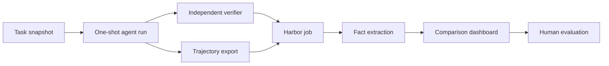

# Agent Eval Lab

[](https://github.com/treitforge/agent-eval-lab/actions/workflows/ci.yml)
[](LICENSE)

Agent Eval Lab extracts verifiable facts from coding-agent runs. It reports what happened. It does not assign ratings, select a winner, or write a human evaluation.

Two agents can pass the same verifier but use very different paths. One agent can inspect the relevant code, make one change, and pass. Another agent can make several failed edits, repeat commands, and then pass. A final reward alone does not show this difference. Agent Eval Lab preserves the evidence needed to examine it.

## What it provides

- Adapters for ATIF, OTLP JSON, SWE-agent, Mini-SWE-Agent, native Codex and Claude JSONL, OpenAI-style chat exports, and OpenHands event exports.
- Exact counts for tool calls, explicit failures, successes, repeats, recoveries, tokens, time, and patch size.
- Source references for facts that need verification.
- A static comparison dashboard for Harbor jobs.
- A reusable Codex skill for fact-only trajectory analysis.
- A public toy Harbor task that demonstrates the full workflow.
- A synthetic sample job that works without model credentials or Docker.

## The workflow



The verifier measures the final behavior. The trajectory shows the process. A human uses both sources to make an evaluation.

## Quick start

Install [uv](https://docs.astral.sh/uv/), clone this repository, and run:

```powershell
uv sync --all-groups
uv run python -m unittest discover -s tests -v
```

Analyze the included ATIF trajectory:

```powershell
uv run trajectory-facts examples/trajectories/atif-toy.json
```

Create the included comparison dashboard:

```powershell
uv run trajectory-dashboard `
  --job examples/sample-harbor-job `
  --output .runs/sample-dashboard
```

Open `.runs/sample-dashboard/index.html` in a browser. The sample data is synthetic. It contains no private model output.

## Run the public Harbor toy task

The optional toy task runs two Codex models through Harbor. It then builds the same fact-only dashboard from their real trajectories.

```powershell
.\scripts\run_toy_e2e.ps1 `
  -Harbor /path/to/harbor `
  -CodexAuthJson /home/you/.codex/auth.json
```

The script keeps credentials outside the repository. It writes tasks, jobs, raw trajectories, patches, verifier logs, and reports only under the ignored `.runs/` directory.

The verifier in the public toy task is visible because the task is a teaching example. Do not use it as a benchmark. Keep active prompts, test data, expected patches, and hidden verifiers in a separate private repository.

## Command-line tools

### `trajectory-facts`

```powershell
uv run trajectory-facts <trajectory.json-or-jsonl> `
  --patch <optional.patch> `
  --json-output facts.json `
  --markdown-output facts.md
```

The analyzer calls a result a failure only when the source has an explicit nonzero return code, error status, or error flag. It does not decide whether a failed result was an agent mistake.

### `trajectory-dashboard`

```powershell
uv run trajectory-dashboard --job <harbor-job-directory> --output <report-directory>
```

The dashboard writes `index.html`, `comparison.json`, `comparison.md`, and one fact report for each trial.

## Documentation

- [Architecture](docs/architecture.md)
- [Evidence model](docs/evidence-model.md)
- [Supported formats](docs/formats.md)
- [Harbor workflow](docs/harbor-workflow.md)
- [Troubleshooting](docs/troubleshooting.md)
- [Add a trajectory adapter](docs/adding-an-adapter.md)
- [Public and private data boundary](docs/security-and-publication.md)
- [Toy examples](examples/README.md)
- [Contributing](CONTRIBUTING.md)

The `design/` directory contains the visual rules used by the dashboard.

## Project status

This project is an early public release. Native vendor formats can change without notice. Prefer ATIF or OTLP when the producer can emit one of those formats. Keep a source fixture for every adapter behavior.

## License

Agent Eval Lab is available under the [MIT License](LICENSE).
